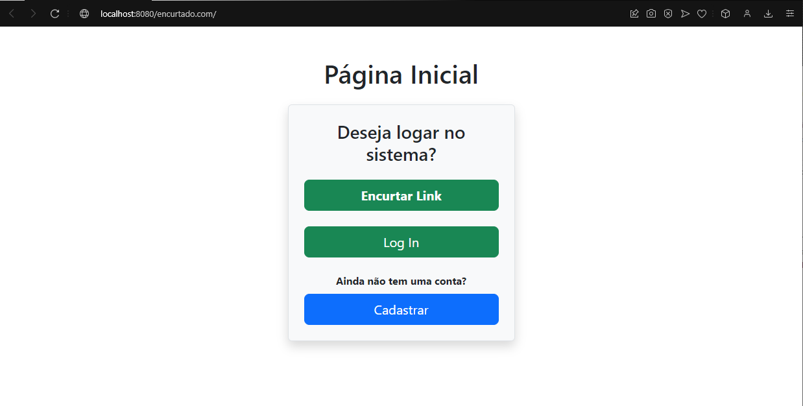

# Projeto Final DSW1 - Encurtador de Links

## Descrição do Projeto

### Autores 👤

O projeto do encurtador de links foi criado pelos alunos do curso de Análise e Desenvolvimento de Sistemas no IFSP - Campus Araraquara abaixo:
- **Gabriel de Pauli Santos.**
- **Gabriel Ventura Pires.**
- **Cauã Grigolatto Domingos.**
- **Rauan Caracciolo.**

### Tecnologias utilizadas 👩‍💻

- **JSP:** Utilizado na criação das páginas usadas no projeto.
- **Java:** Principal linguagem de programação utilizada, necessária para a criação de toda a lógica das funções do programa. **OBS: O aplicativo está configurado para rodar nas versões Java 18+.**
- **Servlet:** Utilizado nos FrontControllers.
- **Command:** Utilizado para efetuar a execução da lógica de controle.
- **Session:** Utilizado para criar a sessão do usuário.
- **Filtros:** Utilizado para conferir a sessão do usuário para poder realizar o encaminhamento para as páginas.
- **SQL:** Utilizado para armazenar os dados no Banco de Dados.
- **Bootstrap:** Utilizado para estilizar as página JSP.
- **CSS:** Utilizado para fazer a estilização das páginas utilizadas.
- **Padrões de Projeto:** Foram utilizados os padrões FrontControler, Command, MVC, DAO, Factory (para DAO).
- **Aplicativos:** MySQL Workbench e Eclipse.

## Sobre o projeto ℹ

Este projeto é uma aplicação Web (desenvolvida no Eclipse) com linguagem JAVA que tem o objetivo de encurtar Links, permitindo o encurtamento aleatório (gerado pelo sistema) ou o personalizado, onde o usuário escolhe o que deseja colocar na personalização do link encurtado. Vale ressaltar que usuários logados terão acesso as duas opções de encurtamento, além de poder visualizar seus links e os acessos referentes a cada link (IP de quem acessou e a quantidade de acessos), já os usuários que não estiverem logados apenas poderão criar o link aleatório, sem que seja possível realizar o "rastreamento" dos acessos. Inclusive, no momento de criação dos links foi adicionado uma opção extra onde o usuário escolhe se o link poderá ser acessado por qualquer pessoa ou somente por ele mesmo, caso seja um link para algo pessoal onde seja necessário restringir o acesso.

Para que o sistema funcione corretamente foram adicionadas algumas funções, irei especificar o que faz cada página abaixo:

- **Página Index:** Esta página possui uma mensagem perguntando se deseja entrar no sistema, um botão para encaminhar para pagina de login e um botão para encaminhar para página de cadastro de usuário.

- **Login:** Esta página possui um formulário de login com usuário (email) e senha, além de um botão para efetuar login, caso os campos não sejam completados corretamente ou o usuário não insira corretamente os dados do login, a página gera uma mensagem de erro.

- **Cadastro:** Está página possui um formulário de cadastro do usuário, solicitando nome, email e senha para que seja efetuado o cadastro, caso os campos não sejam completados corretamente a página gera uma mensagem de erro, mas caso seja cadastrado corretamente ele será notificado do sucesso na realização no cadastro.

- **Logged (Menu do usuário):** Está página possui todas as opções de funções que o usuário terá acesso após realizar o seu Login, as opções são "Encurtar Link", "Personalizar Link", "Meus Links" e "Logout".

- **Encurtar Link:** Está opção encaminha para uma página onde será pedido o link que o usuário deseja encurtar e após o encurtamento aparecerá o link encurtado para o usuário, além de que nesta página haverá a opção de selecionar se o link é privado ou não, caso seja, apenas o usuário poderá acessar este link.

- **Personalizar Link:** Está opção encaminha para uma página onde será pedido o link que o usuário deseja encurtar e também as personalização que ele deseja realizar no link, além de que na página haverá a opção de selecionar se o link é privado ou não, caso seja, apenas o usuário poderá acessar este link. Após o encurtamento realizado, o link irá aparecer na tela para o usuário.

- **Meus Links:** Está opção encaminha para uma página onde será possível que o usuário visualize todos os links criados por ele (aparecerá tanto o URL original quanto o encurtado), junto de um botão "Acessos" que encaminha para página de acessos, um botão "Modificar" que encaminha para uma página para alterar o link e um botão "Deletar" que permite a exclusão deste link da lista de links.

- **Logout:** Está opção invalida a sessão do usuário e faz o logout do sistema, encaminhando para Index.

- **Acessos:** Está opção que fica dentro da página de visualizar links (como "Acessos"), encaminha para a página "Acessos" que permite ao usuário "rastrear" os acessos a seu link, podendo visualizar a quantidade de acessos que o link obteve, além de visualizar o IP de cada acesso realizado.
 
- **Personalizar Link:** Está opção que fica dentro da página de visualizar links (como "Modificar"), encaminha para a página "Personalizar Link" onde será possível fazer alterações no Link encurtado criado anteriormente.

## Tutorial de Instalação ⬇️

Para que o aplicativo funcione corretamente, siga os passos abaixo:

- Baixe e instale o "Eclipse".
- Instale e configure o Tomcat em sua máquina. 
- Clone o repositório do Github no seu aplicativo "Eclipse" com Tomcat configurado como Server.
- Certifique-se que o seu Java está na versão 18+ (versões 18 para cima).
- Abra o MySql e crie o Banco de Dados com a base que está inclusa dentro da pasta “scripts_sql” no Github.
- Configure a conexão com o seu Banco de Dados dentro da Classe "DatabaseConnection" que se localiza na pasta "Connection", alterando o URL, o nome de usuário (root) e a senha (root) já definidos dentro da classe para sua URL, nome de usuário e senha pessoais configurados em seu MySQL.
- Configure o "context.xml", alterando o URL, o nome de usuário e a senha para os configurados em seu MySQL.
- Por último, coloque o sistema para rodar em seu navegador e teste as funcionalidades.

## Screenshots do Sistema em funcionamento 📷

### Página Inicial

Esta é a página inicial onde é possível escolher a opção de "Login", "Cadastrar Usuário" e "Encurtar Link" (sem estar logado).

